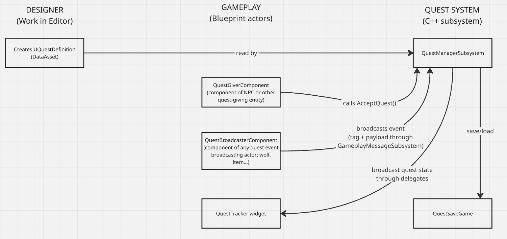

# Data-Driven Quest System (UE5 / C++)

> A decoupled, event-driven quest system for Unreal Engine 5, built to let designers author and extend quests without touching C++

**Video walkthrough:** [coming soon]

---

## Table of Contents

- [Overview](#overview)
- [Key Design Decisions](#key-design-decisions)
- [Architecture](#architecture)
- [Data Flow Example](#data-flow-example)
- [Project Structure](#project-structure)
- [How to Extend](#how-to-extend)
- [Known Limitations & Deliberate Scope Cuts](#known-limitations--deliberate-scope-cuts)
- [Setup & Running the Demo](#setup--running-the-demo)

---

## Overview

This project demonstrates the decoupled approach for quest system implementation in Unreal Engine 5.
Gameplay systems broadcast events (as set of gameplay tags) through Gameplay Message Subsystem without any awareness that the quest
system exists. A central UGameplayMessageSubsystem listens only for the events that are involved in the current quest
objectives and is responsible for all quest progression, state and completion logic. Quest content itself is authored
through Data Assets and gameplay tags - so new quests, objectives and event types can be added right in the engine,
without touching C++.

In this demo the player can accept quests from NPCs, progress through sequential objectives, track quest progress
through a UI-widget and save/load the quest states.

- Engine/version: 5.6.1
- Language: C++ (with some Blueprint demo content)

Core systems demonstrated:
  - Event-driven quest progression via the Gameplay Message Subsystem (gameplay tags + payload structs): decoupling gameplay code from the quest system
  - Data-driven quests as UPrimaryDataAssets. All quests and objectives can be created and edited without touching the code
  - Reusable UQuestGiverComponent and UQuestBroadcasterComponent which let designers turn any Blueprint actor into a quest accepting source and quest event source respectively
  - Sequential objective tracking with quest listeners registered/unregistered dynamically as objectives advance
  - Save/load persistence of quest and objective progress
  - A live UI quest tracker created with Blueprint-assignable delegates
  - Prerequisite checking between quests
  - Prototype of reward mechanic which logs all rewards for completed quests
---

## Key Design Decisions

### Event-driven objectives via the Gameplay Message Subsystem
With this approach the designers and programmers do not have to track what event leads to
which quests' progression. Instead, they just need to send a message (gameplay tag + payload)
that this specific event happened. The message goes through GameplayMessageSubsystem straight to the
QuestManagerSubsystem which advances objectives and tracks their state.

So, for example, the game has 2 different active quests which require the player to kill some wolves.
When a wolf is killed, instead of advancing both of these quests yourself, you send a single event 
message to the QuestManager and both quests advance automatically.

The price for this approach is increased debugging complexity: since all the events are handled
universally in QuestManagerSubsystem you would need more effort to reach the processing of the event you need.
For example, let's say the player killed 2 quest enemies at once, but you need to take a closer look
only at processing of one of these kills. All the events are handled sequentially, so there is no
concurrency problem, but just the problem of identifying the right event in the C++ code

### Broad trigger tags + payload-based context filtering
If you use just 1 gameplay tag as a message to the quest system, there might appear problems when you have to 
process a very specific event. For example, how would you organize the tag structure if you need to process the event
of killing an elite ninja at night with a wooden bow (Event.Kill.Ninja.Elite.Night.WoodenBow - yeah, it terrifies me too)?
So, instead I decided to use the payload structs with multiple modifier tags to keep the tag structure minimalistic
and convenient to use.

So, at first, we have an EventTag which serves as a channel for the GameplayMessageSubsystem (f.e. Event.Kill)
Then, we have an FQuestEventPayload struct serving as a message. This struct contains InstigatorTag - the object of
an event (f.e. Character.Ninja.Elite) and ModifierTags with all the various conditions (f.e. Time.Night, Weapon.WoodenBow).

Each quest objective stores its own TriggerTag (matching one of the broadcasting channels like Event.Kill).
It also has a RequiredModifierTags container. When a message arrives, the objective first checks whether 
the channel matches. Then it checks whether the payload's combined tags (InstigatorTag + ModifierTags)
satisfy the RequiredModifierTags set. Overall, this mechanism keeps the tag vocabulary small and supports
tag filtering functions for objectives.

### Data assets for authoring, subsystem for runtime state
The system has static designer-authored data (UQuestDefinitions) from dynamic, per-playthrough runtime
state (FActiveQuestStates). UQuestDefinition instances are Data Assets - shared, immutable at runtime
and safely referenced by active quest instances. FActiveQuestState is created when a quest is accepted and
and holds only what changes over time: current objective index and per-objective progress.

Keeping these separated matters for 2 reasons. First, it prevents accidental mutation of "golden" quest
definition. If it is mutated, it would affect all future playthroughs and other players (if we make a
multiplayer game). Second, it allows to make save/load more straightforward by keeping a small needed
amount of data for serialization instead of storing all the names, objectives and descriptions.

---

## Architecture



## Data Flow Example

Goal: complete the quest "Hunt Begins"

1. You approach the Hunter and interact with him -> QuestGiverComponent in Hunter actor launches AcceptQuest(). UI widget shows sign "Kill 2 alpha wolves in the forest 0/2" 
2. You approach a normal wolf and kill it -> QuestBroadcasterComponent in Wolf actor broadcasts message to Gameplay Message Subsystem. Nothing happens, because the message didn't contain a tag for an alpha wolf
3. You approach an alpha wolf and kill it -> The message with the needed tags is sent before the Wolf actor gets destroyed. UI widget shows your new progress as 1/2
4. You approach the second alpha wolf and kill it -> The second message is sent and the transition to the new objective happens. UI widget shows sign "Tell the peasant you avenged his family 0/1"
5. You interact with the Peasant -> Quest sign disappears from UI widget. The quest reward was logged to LogTemp. The quest is complete

---

### Core Classes

| Class/Struct | Responsibility                                                 |
|---|----------------------------------------------------------------|
| `UQuestDefinition` | Designer-authored, static quest data (Data Asset)              |
| `FQuestObjectiveData` | Static definition of a single objective                        |
| `FActiveQuestState` | Runtime progress for one active quest instance                 |
| `UQuestManagerSubsystem` | Core runtime logic: accept, track, complete quests             |
| `FQuestEventPayload` | Contract struct broadcast on the Gameplay Message Subsystem    |
| `UQuestBroadcasterComponent` | Reusable component letting any actor broadcast quest events    |
| `UQuestGiverComponent` | Reusable component exposing `AcceptQuest` to Blueprint-authored NPCs |
| `UQuestSaveGame` / `FQuestSaveData` | Persistence layer                                              |

---

## Project Structure

```
Source/QuestSystem/
├── Public/
│   ├── DataClasses/
│   │   ├── QuestData.h
│   │   ├── QuestObjectiveData.h
│   │   ├── QuestDefinition.h
│   │   └── QuestSaveGame.h
│   ├── QuestManagers/
│   │   └── QuestManagerSubsystem.h
│   └── ActorQuestComponents/
│       ├── QuestBroadcasterComponent.h
│       └── QuestGiverComponent.h
└── Private/
    └── [mirrors Public/ where applicable]
```

---

## How to Extend

### Adding a new quest

1. Create instance of QuestDefinition Data Asset
2. Create a unique gameplay tag for the Quest and provide it to QuestID in the Data Asset (e.g. Quest.HuntBegins)
3. Fill other fields of the data asset (name, description, prerequisites, reward). Make sure that it has at least 1 objective
4. Fill all the fields of the objectives (trigger tag, required modifier tags, required count, description). Make sure that the provided TriggerTag is the event tag which would be a channel for GameplayMessageSubsystem message (e.g. Event.Kill)

### Adding a new quest giver

1. Add Blueprint component QuestGiverComponent to any actor
2. Assign your Quest data asset to the field QuestToGive in QuestGiverComponent
3. Call QuestGiverComponent.AcceptQuest() in your actor's logic when you want to give this quest to the player

### Adding a new gameplay event broadcaster

1. Add Blueprint component QuestBroadcasterComponent to any actor (e.g. enemy, collectible, weapon...)
2. Fill all the fields of the component: EventTag (what happened, e.g. Event.Kill), InstigatorTag (happened to whom, e.g. Character.Wolf), ModifierTags (specifics of an event, e.g. Time.Day, Weapon.Sword), Amount
3. Call QuestBroadcasterComponent.BroadcastQuestEvent() when the relevant gameplay moment happens

---

## Known Limitations & Deliberate Scope Cuts

| Limitation                                               | Why it is not present                                                                                                                                                                               | How it would be solved at larger scale                                                                                                                                                                                                   |
|----------------------------------------------------------|-----------------------------------------------------------------------------------------------------------------------------------------------------------------------------------------------------|------------------------------------------------------------------------------------------------------------------------------------------------------------------------------------------------------------------------------------------|
| No branching quest graphs (sequential only)              | Suitable scale for a demo with a different focus                                                                                                                                                    | Create a 'Branch' label for QuestObjectiveData. Enable/disable it as a result of other quests/objectives. Check active/required branches when you advance through objectives                                                             |
| No simultaneous objectives (only one at a time)          | For simplified UI in demo                                                                                                                                                                           | Split objectives into tasks, so instead of 1 listener per objective you would have 1 listener per task in the objective                                                                                                                  |
| No retroactive credit for events before quest acceptance | Suitable scale for a demo with a different focus                                                                                                                                                    | Create a buffer of recently happened events or create quests hidden from the player which would track possible retroactive events (then it's better to have as few of them as possible just for the important stuff, not killing wolves) |
| No world reactivity framework                            | The same decoupling pattern (gameplay->quest) was already demonstrated with QuestManager. Building this system would be the repetition of the Quest System architecture without bringing a new idea | A separate subsystem which is also communicated with messages through GameplayMessageSubsystem. Provided with code/blueprint logic for different objective/quest outcomes                                                                |
| No caching quest references for quicker loading          | Demo scale makes the cost of TryLoad() on each resolution negligible                                                                                                                                | Cache already loaded quests and try to retrieve them from there before loading by path                                                                                                                                                   |

---

## Setup & Running the Demo

### Requirements
- UE version: 5.6.1
- Visual Studio / Rider:

### Steps
1. Clone the repo
2. Launch the project with your IDE
3. Have fun!

### Controls
- WASD - movement
- E - interact with quest givers/NPCs
- LMB - attack
- 5 - save quest state
- 7 - load quest state

### Demo quests included
- **Beggar Life** - objective: collect 3 coins. Simple quest with 1 objective and intermediate progress
- **Hunt Begins** - objectives: kill 2 alpha wolves, interact with the peasant. More complex quest showcasing tag requirements (killing alpha wolves, not regular ones), transition to next objective

---

## Credits / Attribution

- Gameplay Message Subsystem plugin (contained in Lyra starter game): https://www.fab.com/listings/93faede1-4434-47c0-85f1-bf27c0820ad0
- Miro for creating architecture scheme: https://miro.com
- Steve's Unreal Quest System (inspiration and technical insights): https://github.com/sinbad/SUQS/tree/master
